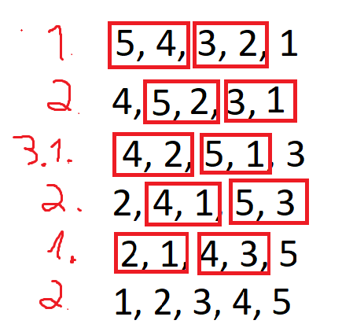

# Pairing Sort

### O que é?
Este é um algoritmo de ordenação que inventei, não tenho certeza se ele já existe, mas que eu criei tudo do fruto do meu cérebro.

### Como funciona?
Vamos seguir esse passo a passo:

1. Se o número de números for par, ele vai separar em pares do começo da lista até o final, caso for ímpar, ainda irá separar em pares, mas vai deixar o último elemento de fora. Assim, ele irá comparar cada elemento dos pares, se o número a esquerda no par for maior que o da direita, então trocamos os números, caso não for, deixamos como está, com isso, vamos fazer com todos os pares.

2. Vamos fazer algo parecido com o passo 1, porém, ao invés de começar do primeiro elemento, vamos começar do segundo, assim, façamos os pares e as comparações

3. Repetimos os passos 1 e 2 até que a lista esteja ordenada.

### Ilustração:


### Qual a complexidade?
Talvez eu mude esse texto mais para frente, por n motivos, mas acredito que:
- Comparações:
  - Melhor: O(n)
  - Médio: Não faço ideia
  - Pior: O(n * (n / 2))
- Movimentações: Não faço ideia
- Espaço: O(1)

Provavelmente vou estudar mais afundo nisso de complexidade e irei mudar no futuro.

### Código sugerido:
```python
def pairing_sort(data):
  change = True
  while change:
    change = False
    for i in range(0, len(data) - 1, 2):
      if data[i] > data[i+1]:
        data[i], data[i+1]= data[i+1], data[i]
        change = True

    for j in range(1, len(data) - 1, 2):
      if data[j] > data[j+1]:
        data[j], data[j+1]= data[j+1], data[j]
        change = True

  return data
```

Agora, vamos a comparação com outros tipos de algoritmos de ordenação:

*ATENÇÃO*: Todos as comparações estão no único arquivo: main.ipynb